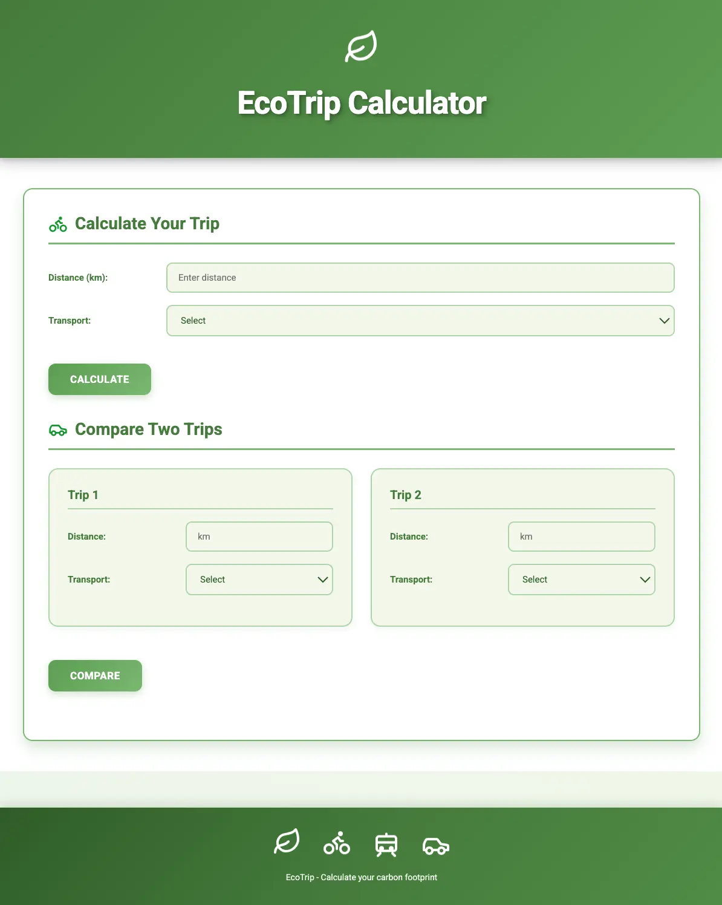

# EcoTrip Calculator
[](https://github.com/coda-school/eco-trip-calculator/actions/workflows/ci.yml)
[](https://sonarcloud.io/summary/new_code?id=coda-school_eco-trip-calculator)
[](https://sonarcloud.io/summary/new_code?id=coda-school_eco-trip-calculator)
[](https://sonarcloud.io/summary/new_code?id=coda-school_eco-trip-calculator)
[](https://sonarcloud.io/summary/new_code?id=coda-school_eco-trip-calculator)

> **⚠️ WARNING: This codebase is intentionally written with poor quality for educational purposes!**

This project is designed for a Software Craftsmanship training course. The code contains deliberate anti-patterns, code smells, and bad practices that students will identify and refactor.

## Project Purpose

This is a **legacy code base** that students will work on to practice:
- Clean Code principles
- SOLID principles
- Design Patterns (GoF)
- Test-Driven Development (TDD)
- Refactoring techniques
- Green IT

## Features


`EcoTrip Calculator` allows users to:

- Calculate the carbon footprint of a trip based on distance and transport type
- Take into account the number of passengers for cars
- Handle different car types (thermal, electric, hybrid)
- Calculate train trips with country-specific CO2 factors
- Compare two trips to find the most ecological option

## Getting Started
### Prerequisites
- Node.js 18+
- npm or yarn

### Installation

1. Install backend dependencies:
```bash
cd backend
npm install
```

2. Install frontend dependencies:
```bash
cd frontend
npm install
```

### Running the Project

1. Start the backend:
```bash
cd backend
npm start
# Server runs on http://localhost:3000
```

2. Build and serve the frontend:
```bash
cd frontend
npm run build
# Open dist/index.html in a browser
# Or use a simple HTTP server:
npx http-server dist -p 8080
```

### Running Tests

Backend tests:
```bash
cd backend
npm test
```

Frontend tests:
```bash
cd frontend
npm test
```